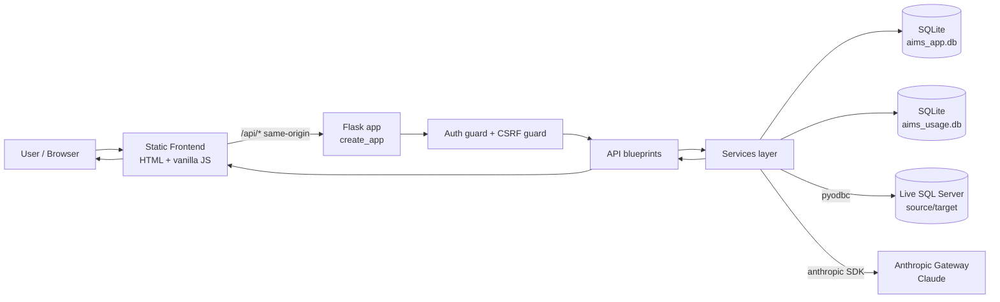

# 01 — Executive Summary

## Purpose

**AI Mapping Studio** helps data‑migration teams build, review, and export **column‑level source‑to‑target mappings** for enterprise data migrations (the sample domain is insurance / Guidewire‑style claims). It uses a large language model (Anthropic Claude) to propose how each target column should be populated from a legacy source schema, then gives analysts a workspace to review, correct, validate, and turn those mappings into runnable SQL Server ETL code.

## Business problem it solves

Data migrations require a **Source‑to‑Target Mapping (STTM)**: for every target column, which source column(s) feed it, what transformation applies, and how keys/joins line up. Doing this by hand across hundreds of tables is slow and error‑prone. AI Mapping Studio:

- Ingests **source** and **target** schemas (from a live SQL Server or from uploaded data dictionaries / DDL / spreadsheets).
- Uses Claude to **generate candidate mappings** (mapping type, transformation rule, business rule, null handling, confidence, and the SQL JOIN that assembles each target entity).
- Provides a **review workspace** (approve/reject/edit/regenerate, confidence scoring, validation rules).
- Generates **ETL stored procedures and CREATE TABLE DDL**, lets the user edit them, and can **deploy** to SQL Server with an AI **auto‑fix** step for syntax errors (surfaced for human review, never auto‑deployed).
- Exports the mapping document (CSV/JSON).

## Target users

- **Migration Leads / Data Architects** — configure sources/targets, generate and approve mappings, produce ETL.
- **Business Analysts / QA** — review mappings, validate, comment.
- **Administrators** — create/delete user accounts (self‑signup is disabled by default).

Each user works inside one or more **Clients** (engagement workspaces); all working data is isolated per user + client.

## Major capabilities

| Capability | Where |
|---|---|
| Source & Target connection management (SQL Server or File System) | `js/source-systems.js`, `js/target-system.js` |
| AI schema extraction from uploaded files (Excel/PDF/Word/SQL/text) | `server/app/services/extraction_service.py` |
| AI mapping generation (per‑entity, per‑field‑chunk loop) | `server/app/services/mapping_service.py` |
| Mapping review workspace (approve/reject/edit/regenerate) | `js/mapping-workspace.js` |
| Client‑side validation engine (7 rules) | `js/validation.js` |
| ETL stored‑proc & DDL generation (deterministic + AI) | `js/etl-code.js`, `server/app/services/etl_service.py` |
| SQL deploy with AI auto‑fix (human‑gated) | `server/app/services/deployment_service.py`, `ai_fix_service.py` |
| Export (CSV/JSON real; XLSX/PDF simulated) | `js/export.js` |
| AI usage telemetry & report | `server/app/services/ai_usage_logger.py`, `js/ai-usage-report.js` |
| Multi‑tenant auth, clients, per‑tenant data isolation | `server/app/services/{auth,client,tenant_store,admin}_service.py` |

## Technology stack (high level)

- **Frontend:** HTML5, CSS (token‑based theming, light/dark), **vanilla JavaScript** (no framework/build). Bootstrap 5.3.3, Bootstrap Icons 1.11.3, SheetJS (xlsx) 0.18.5 — all via CDN.
- **Backend:** **Python + Flask 3** app factory; `pyodbc` (SQL Server), `anthropic` SDK (Claude), `openpyxl`/`pypdf`/`python-docx` (file parsing) — all optional‑guarded.
- **Datastores:** **SQLite** (stdlib `sqlite3`) — `aims_app.db` (identity + tenant documents) and `aims_usage.db` (AI usage log).
- **Auth:** Flask signed‑cookie sessions; Werkzeug password hashing; CSRF double‑submit.

## AI capabilities

Claude is called for: **mapping generation**, **single‑field regeneration**, **source schema extraction** (standard + "rich" PK/FK detection), **ETL stored‑proc generation**, **CREATE TABLE DDL generation**, **Add‑Column / Add‑Entity from natural language**, and **deploy‑time SQL auto‑fix**. All calls share one plumbing layer with a structured‑output fallback ladder and are logged (token counts only) to the usage DB. There is **no RAG, no vector database, and no autonomous agent loop** — every call is a single, bounded request/response (see [10](10-ai-genai-architecture.md)).

## High‑level architecture

