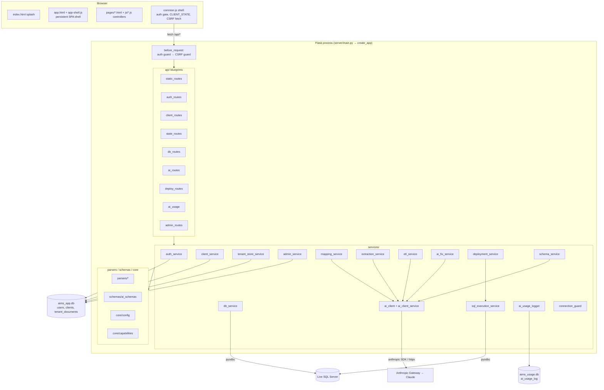
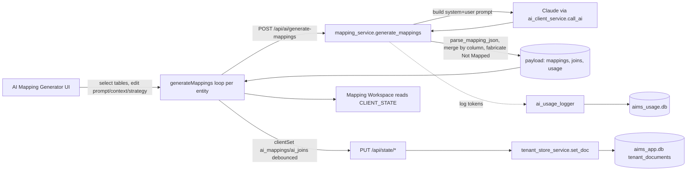

# 03 — System Architecture

## Overview

AI Mapping Studio is a **single‑origin** app: one Flask process serves both the static frontend and the `/api/*` endpoints, so the browser calls the API with no CORS. The frontend holds no long‑lived secrets; all privileged work (DB access, LLM calls, persistence) happens server‑side.

Three external/data systems are involved:
- **SQLite** (two files) — the application's own persistence: identity + per‑tenant working documents (`aims_app.db`) and AI usage telemetry (`aims_usage.db`).
- **Live Microsoft SQL Server** — the *subject* of the migration (a source and/or a target), accessed per‑request via `pyodbc`. Never the app's own store.
- **Anthropic Claude** — via a corporate gateway (`ANTHROPIC_BASE_URL`), using the `anthropic` SDK.

## Layered backend

Strict downward import direction — **`api → services → parsers/schemas → core`** (documented in `server/README.md`):

- **`api/`** — thin Flask blueprints. Parse request → call a service → `jsonify((payload, status))`. No business logic.
- **`services/`** — business logic. Each returns `(payload_dict, http_status)` or raises; owns DB/LLM/pyodbc calls.
- **`parsers/`** — pure functions (no Flask/Anthropic): SQL DDL parsing, file/Excel parsing, text chunking, SQL batch splitting.
- **`schemas/`** — the JSON Schemas for Claude structured output.
- **`core/`** — `config.py` (env + tuning constants) and `capabilities.py` (optional‑import guards).

## Component diagram

## Frontend architecture

- **Splash** `index.html` → link into the **SPA shell** `pages/app.html`.
- **SPA shell** (`js/app-shell.js`) hosts an `<iframe>`; sidebar clicks swap only the iframe `src` (hash routing) so the sidebar/header persist and don't reload. `NON_FRAMED` flows (login, onboarding, admin, the shell itself) navigate full‑page.
- **Shared shell** `js/common.js` `initShell()`: applies theme, gates auth (`GET /api/auth/me`), hydrates `CLIENT_STATE` (`GET /api/state`), and — when not framed — injects the sidebar/header. It also installs a **CSRF fetch wrapper** that adds `X-CSRF-Token` to mutating same‑origin requests.
- **State model:** per‑client (tenant) data lives **server‑side**; the browser keeps an in‑memory `CLIENT_STATE` cache and reads it synchronously via `clientGet`; writes go through a debounced `PUT /api/state/<doc_key>`. Device/UI prefs stay in `localStorage`.

See [06 — Frontend](06-frontend.md) for full detail.

## Data‑flow diagram (mapping generation as the canonical path)

## Deployment topology

**Current Implementation:** a single Flask **development** server (`app.run(host="127.0.0.1", port=8000, debug=True, use_reloader=False)`), no containerization, no reverse proxy, no CI/CD. See [19 — Deployment](19-deployment.md).
