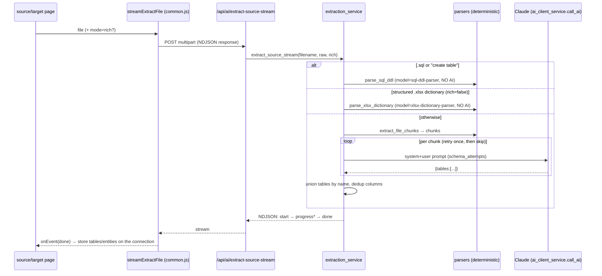

# 05 — End‑to‑End Application Flow

This section traces the major workflows with real file/function references and Mermaid sequence diagrams, then walks one complete user journey.

## A. Login → shell ready

```mermaid
sequenceDiagram
  participant U as User
  participant L as login.html / auth.js
  participant API as /api/auth
  participant SVC as auth_service
  participant DB as aims_app.db
  U->>L: submit email + password
  L->>API: POST /api/auth/login {email,password}
  API->>SVC: login_locked_seconds(email)
  API->>SVC: authenticate_result(email,password)
  SVC->>DB: SELECT user; check_password_hash
  SVC-->>API: (user | None, reason)
  API->>SVC: record_login_result / list_clients
  API-->>L: {ok,user,clients,activeClientId,needsOnboarding} + set session
  alt admin
    L->>U: redirect /pages/admin.html
  else no client
    L->>U: redirect /onboarding
  else has client
    L->>U: redirect /pages/app.html#dashboard.html
  end
```

Then every shell page runs `initShell()` (`js/common.js`): `applyTheme` → `GET /api/auth/me` (401 → `/login`) → hydrate `CLIENT_STATE` via `GET /api/state` → inject sidebar/header (non‑framed) or defer to the persistent shell (framed).

## B. Upload a file → AI schema extraction (streaming)



Client fallback ladder (`streamExtractFile`): if the stream can't open, has no body, drops before `done`, or ends without a result → it re‑POSTs the non‑streaming `/api/ai/extract-source`.

## C. Generate mappings

```mermaid
sequenceDiagram
  participant UI as ai-mapping.js
  participant SRC as loadSource
  participant DB as /api/db/metadata (SQL src)
  participant API as /api/ai/generate-mappings
  participant MAP as mapping_service.generate_mappings
  participant AI as Claude
  UI->>SRC: resolve source tables/columns
  alt SQL source
    SRC->>DB: POST {connection...} → tables[]
  else File source
    SRC->>SRC: read tables[] off the connection
  end
  loop per chosen target entity
    UI->>API: POST {source, targetEntities:[one], businessContext, strategy, systemPrompt?}
    API->>MAP: generate_mappings(body)
    MAP->>MAP: build system prompt (default or override) + user block
    loop per field-chunk (FIELD_CHUNK=40)
      MAP->>AI: call_ai("AI Mapping Generator", schema_attempts(MAPPING_ITEM_SCHEMA), max_tokens=16000)
      AI-->>MAP: {mappings, joins}
    end
    MAP->>MAP: merge by (entity,column); fabricate "Not Mapped" for omitted fields
    MAP-->>API: {ok, mappings, joins, usage, returnedCount}
    API-->>UI: payload (console logs per table)
  end
  UI->>UI: upsert into aims_ai_mappings + aims_ai_joins (clientSet, debounced)
```

## D. Review, approve/edit/regenerate (workspace)

- Rows read from `aims_ai_mappings` + `applyOverrides()`.
- Display: `confidenceBar`/`confidenceLevel` (thresholds), `displayValidationStatus` (override or live `autoValidationStatus`), `rowStatusClass` (manual reviewStatus wins; else confidence‑derived tint).
- Actions write via `saveMappingOverride` + `addHistoryRecord`: `approveMapping`, `rejectMapping`, `makeCellEditable`/`editMapping` ("Modified by User"), `regenerateMapping` → `POST /api/ai/regenerate-mapping` (grounded on the full source schema).

## E. ETL generation + deploy (with AI auto‑fix, human‑gated)

```mermaid
sequenceDiagram
  participant UI as etl-code.js
  participant API as /api/ai/generate-etl (or /generate-ddl)
  participant ETL as etl_service
  participant DEP as /api/deploy → deployment_service
  participant SQLE as sql_execution_service
  participant FIX as ai_fix_service
  UI->>API: POST {targetTable, columns, mappings, join, instructions}
  API->>ETL: generate_etl / generate_ddl (continuation on max_tokens)
  ETL-->>UI: SQL (editable in a textarea)
  UI->>DEP: POST /api/deploy {connection, sql, dryRun}
  DEP->>SQLE: split GO batches; run in ONE transaction
  alt a batch fails
    SQLE-->>DEP: error (number, line, batch)
    DEP->>FIX: fix_batch(batch, error)  (no credentials in prompt)
    FIX-->>DEP: corrected batch
    DEP-->>UI: status=needs_review + corrected SQL (NOT auto-deployed)
    UI->>UI: load fixed SQL into editor; user re-clicks Deploy
  else all succeed
    DEP-->>UI: status=succeeded
  end
  UI->>UI: poll GET /api/deploy/status/<job_id> every 2s; mirror log
```

## F. Persistence (any tenant write)

`clientSet(docKey, value)` updates `CLIENT_STATE` and schedules a debounced `PUT /api/state/<docKey>` → `state_routes.put_doc` → `tenant_store_service.set_doc(uid, cid, key, value)` → upsert into `tenant_documents` scoped by the **session's** `(uid, cid)`. Pending writes flush on `pagehide`/`visibilitychange` with `keepalive`.

---

## Sample end‑to‑end user journey

**Use case:** *"As a Migration Lead, generate mappings for the target table `Policy` from a live SQL Server source, review them, and export."*

1. **Login.** `login.html` → `auth.js` submit → `POST /api/auth/login` → `auth_routes.login` → `auth_service.authenticate_result` → session set → redirect to `/pages/app.html#dashboard.html`.
2. **Shell boot.** `js/app-shell.js` builds the shell; `initShell` (`common.js`) gates auth (`GET /api/auth/me` → `auth_routes.me`) and hydrates state (`GET /api/state` → `state_routes.get_bundle` → `tenant_store_service.get_bundle`).
3. **Add a source (SQL Server).** Source Systems (`source-systems.js` `saveConnectionForm`) stores the connection in `aims_db_connections` (tenant doc). Test via `POST /api/db/test` → `db_routes.test_connection` → `db_service.test_connection`.
4. **Set the active target.** Target System (`target-system.js`): `loadSqlTables` → `POST /api/db/metadata` → `db_service.get_metadata` → `dbMetadataToEntities` → `setActiveTarget` (materializes `getTargetSchema()`).
5. **Open the AI Mapping Generator.** `ai-mapping.js` on load: `checkAiStatus` (`GET /api/ai/status`), `initSystemPrompt` (`GET /api/ai/mapping-prompt?strategy=Balanced`), `seedStrategyFromSettings`, `renderTablePicker`. User selects the `Policy` table (and columns).
6. **Generate.** `generateMappings()` → `loadSource()` (SQL → `ensureConnPassword` + `POST /api/db/metadata`) → loop: `POST /api/ai/generate-mappings` `{source, targetEntities:[Policy], businessContext, strategy, systemPrompt?}` → `mapping_service.generate_mappings` builds the prompts, calls Claude (`ai_client_service.call_ai`, `MAPPING_ITEM_SCHEMA`, `max_tokens=16000`), parses with `parse_mapping_json`, merges by column, fabricates "Not Mapped" rows for omitted fields, returns `{mappings, joins, usage}`.
7. **Store.** `buildMappingRows` computes `validationStatus`/`reviewStatus`; results upserted into `aims_ai_mappings` and joins into `aims_ai_joins` via `clientSet` → `PUT /api/state/*` → `tenant_store_service.set_doc` → `tenant_documents`. A history record is written per table. Token usage is logged to `aims_usage.db`.
8. **Review.** Mapping Workspace (`mapping-workspace.js`) renders the `Policy` rows; the lead approves some (`approveMapping`), edits a transformation (`editMapping` → "Modified by User"), and regenerates one field (`regenerateMapping` → `POST /api/ai/regenerate-mapping`).
9. **Validate.** Validation (`validation.js`) runs the 7 rules; VR‑07 flags any mapping below the Medium confidence threshold.
10. **Export.** Export (`export.js` `generateExport` → `buildCSV`/`buildJSON`) produces the mapping document and records it in `aims_exports`.

Every step's tenant writes are isolated to `(user_id, client_id)`; token usage is visible in the AI Usage Report.
