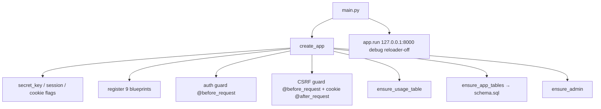

# 07 — Backend

## Entry point & startup flow

`server/main.py` imports `app` (from `server/app/__init__.py`) and `port()` (from `core/config`). Importing the package runs the module‑level `app = create_app()`. `__main__` then runs:

```python
app.run(host="127.0.0.1", port=port(), debug=True, use_reloader=False)
```

`use_reloader=False` is deliberate — the reloader would kill in‑flight background **deploy threads** and wipe the in‑memory deploy job store.

### `create_app()` (`server/app/__init__.py`)

1. `Flask(__name__, static_folder=None)` — Flask's static handler is **disabled**; `static_routes.py` serves everything.
2. Reads `secret_key()`, `session_hours()`, `csrf_enabled()`, `signup_enabled()` from `core/config`.
3. `application.secret_key = secret_key()` — if `AIMS_SECRET_KEY` is empty, generates `secrets.token_hex(32)` and **prints a warning** (sessions won't survive restart).
4. `permanent_session_lifetime = timedelta(hours=session_hours())` (default 12). `SESSION_COOKIE_HTTPONLY=True`, `SESSION_COOKIE_SAMESITE="Lax"`. Stores `CSRF_ENABLED`, `SIGNUP_ENABLED` in `application.config`.
5. **Blueprint registration order:** `static_bp, auth_bp, client_bp, state_bp, db_bp, ai_bp, deploy_bp, ai_usage_bp, admin_bp`.
6. `_register_auth_guard(application)` — installs the `@before_request` session gate.
7. `_register_csrf(application)` — installs a second `@before_request` (CSRF) + an `@after_request` (issue cookie). **Order matters:** the auth guard runs before the CSRF guard, so an unauthenticated mutating request returns **401**, not 403.
8. Idempotent init: `ensure_usage_table()` (usage DB), `ensure_app_tables()` (runs `schema.sql` + adds `is_admin` to legacy `users`), `ensure_admin()` (env‑seeds/promotes the admin). `config._load_dotenv()` already ran at import (loads `server/.env` unless `AIMS_DISABLE_DOTENV`; real env wins).



## Request lifecycle & guards

Every request passes two `before_request` hooks:

1. **Auth guard** (`_auth_guard`): allowlist `PUBLIC_PATHS = {"/","/index.html","/login","/onboarding","/favicon.ico"}`, `PUBLIC_PREFIXES = ("/css/","/js/","/assets/")`, and any `/api/auth/`. Otherwise a session (`session["uid"]`) is required: unauthenticated `/api/*` → **401 JSON**, unauthenticated HTML → **302 → /login**. Admins are confined to `/pages/admin.html`; non‑admins are bounced off it; a non‑admin without an active client is sent to `/onboarding`. Bypassed only when `AUTH_DISABLED` (tests).
2. **CSRF guard** (`_csrf_guard`): for `{POST,PUT,PATCH,DELETE}` under `/api/` **except** `/api/auth/`, compares the `csrf_token` cookie to the `X-CSRF-Token` header with `secrets.compare_digest`; mismatch/absent → **403**. Disabled under `AUTH_DISABLED` or when `CSRF_ENABLED` is false.

## Layers (import direction `api → services → parsers/schemas → core`)

- **`api/`** blueprints are thin: parse request → call service → `jsonify(payload), status`. See [08](08-api-documentation.md).
- **`services/`** hold all logic and return `(payload, status)` or raise. See [04](04-repository-structure.md) for the table.
- **`parsers/`** are pure (no Flask/Anthropic). See [10 §Parsers] and [11].
- **`schemas/ai_schemas.py`** — Claude JSON Schemas. See [11 §JSON schemas].
- **`core/config.py`** — env + tuning constants (see [15](15-configuration.md)); **`core/capabilities.py`** — optional imports (`pyodbc`, `anthropic`, `openpyxl`, `PdfReader`, `docx`), each `None` when absent so the app boots regardless.

## Business logic highlights

- **Mapping generation** (`mapping_service.generate_mappings`): loops **per target entity**, and within an entity splits fields into chunks of `FIELD_CHUNK=40`; merges results by `(entity,column)`; fabricates a "Not Mapped" row for any requested field the model omitted; also returns per‑entity JOIN conditions. Accepts a `systemPrompt` override; otherwise uses `default_mapping_system_prompt(strategy)`.
- **Extraction** (`extraction_service`): deterministic fast‑paths (SQL DDL parser, structured‑Excel dictionary parser) with **no AI**; otherwise chunk the file and call Claude per chunk (retry once, then skip), unioning tables by name. The `-stream` variant emits NDJSON progress.
- **ETL/DDL** (`etl_service`): builds a stored proc / CREATE TABLE from a template + mappings, with auto‑continuation (up to `_CONTINUE_LIMIT=5`) if the model hits `max_tokens`; strips code fences and a leading `USE [db]` (unless instructed to keep it); flags hallucinated DDL columns.
- **Deploy** (`deployment_service` + `sql_execution_service`): a background daemon thread runs GO‑split batches in **one transaction** (rollback on any failure); on failure it asks Claude (`ai_fix_service.fix_batch`) for a corrected batch and stops in **`needs_review`** — the fix is never auto‑deployed. Jobs are kept in an in‑memory store keyed by `job_id`, bound to the tenant `(uid,cid)`.
- **Schema edits** (`schema_service`): `parse_column`/`parse_entity` turn natural language (or a pasted dictionary) into column/entity definitions, flagging duplicates and coercing unsupported types.

## Validation & authorization

- **Input validation** lives in the services (email regex, password length, name/industry caps, `doc_key` allowlist, doc size cap) — see [16](16-security.md).
- **Authorization** is enforced in the service layer using the **session** `(uid, cid)` (never client‑supplied ids): `client_service.owns_client`, `tenant_store_service` scoping, `admin_service.is_admin`, deploy job owner checks.

## Database access

All app persistence goes through `server/app/db/app_db.py` (`connect()` sets `row_factory=Row` and `PRAGMA foreign_keys=ON`; a process‑wide `write_lock()` serializes writes). The usage DB uses its own connection/lock in `ai_usage_logger.py`. Live SQL Server access is per‑request via `pyodbc` in `db_service`/`sql_execution_service`. See [09](09-database.md).

## External integrations

Anthropic Claude via `ai_client.anthropic_client()` (httpx client trusting the corporate CA bundle when present); live SQL Server via `pyodbc`. See [14](14-external-integrations.md).

## Logging & error handling

Services catch broad exceptions, `traceback.print_exc()`, and return `({"ok":False,"error":...}, 400)`; AI calls additionally log a `status="failed"` usage row and re‑raise. See [17](17-error-handling.md) and [18](18-logging-monitoring.md).
