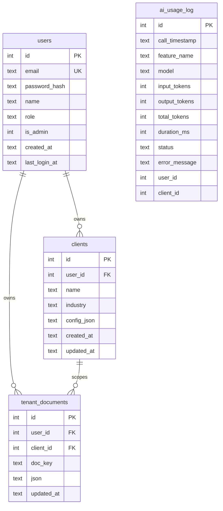

# 09 — Database

## Technology & connection

- **SQLite** via the Python stdlib `sqlite3` — no ORM, no external DB server for the app itself.
- Two separate SQLite files:
  - **`aims_app.db`** (path from `AIMS_APP_DB`, default `server/aims_app.db`) — identity + per‑tenant working documents. Access via `server/app/db/app_db.py`.
  - **`aims_usage.db`** (path from `AIMS_USAGE_DB`, default `server/aims_usage.db`) — AI usage telemetry. Access via `server/app/services/ai_usage_logger.py`.
- Both files are **gitignored** (`*.db`).
- **Live Microsoft SQL Server** is a *source/target of the migration*, not the app store — accessed per‑request via `pyodbc` (`db_service`, `sql_execution_service`). No schema is owned there by this app.

### `connect()` / `write_lock()` (`app_db.py`)
`connect()` = `sqlite3.connect(app_db_path(), timeout=10.0)`, `row_factory = sqlite3.Row`, then `PRAGMA foreign_keys = ON` (SQLite defaults FKs OFF — required for the cascades below). `write_lock()` exposes a **process‑wide** `threading.Lock`; every write path acquires it and uses short‑lived open→commit→close in `try/finally` (SQLite is single‑writer). The lock is not reentrant; services never nest acquisitions. `ensure_app_tables()` runs `schema.sql` via `executescript`, then ALTERs `is_admin` onto a legacy `users` table.

## `aims_app.db` schema (`server/app/db/schema.sql`)

### `users`
| Column | Type | Constraints |
|---|---|---|
| id | INTEGER | PK AUTOINCREMENT |
| email | TEXT | NOT NULL, UNIQUE (stored lowercased) |
| password_hash | TEXT | NOT NULL (Werkzeug scrypt/pbkdf2; never returned) |
| name | TEXT | — |
| role | TEXT | DEFAULT 'Migration Lead' |
| is_admin | INTEGER | NOT NULL DEFAULT 0 |
| created_at | TEXT | NOT NULL |
| last_login_at | TEXT | — |

### `clients`
| Column | Type | Constraints |
|---|---|---|
| id | INTEGER | PK AUTOINCREMENT |
| user_id | INTEGER | NOT NULL, FK → users(id) ON DELETE CASCADE |
| name | TEXT | NOT NULL |
| industry | TEXT | — |
| config_json | TEXT | — (onboarding extras) |
| created_at | TEXT | NOT NULL |
| updated_at | TEXT | — |
| — | — | **UNIQUE(user_id, name)** |

Index: `ix_clients_user ON clients(user_id)`.

### `tenant_documents`
| Column | Type | Constraints |
|---|---|---|
| id | INTEGER | PK AUTOINCREMENT |
| user_id | INTEGER | NOT NULL, FK → users(id) ON DELETE CASCADE |
| client_id | INTEGER | NOT NULL, FK → clients(id) ON DELETE CASCADE |
| doc_key | TEXT | NOT NULL |
| json | TEXT | NOT NULL (the exact blob the frontend used to keep in localStorage) |
| updated_at | TEXT | NOT NULL |
| — | — | **UNIQUE(user_id, client_id, doc_key)** |

Index: `ix_docs_scope ON tenant_documents(user_id, client_id)`.

`doc_key` is constrained in **application code** (`tenant_store_service.ALLOWED_DOC_KEYS`, 12 values) — not in the schema. Per‑doc size cap `_MAX_DOC_CHARS = 6_000_000` (→ 413). Upsert uses `ON CONFLICT(user_id, client_id, doc_key) DO UPDATE`.

## `aims_usage.db` schema (`ai_usage_logger.py`)

### `ai_usage_log`
| Column | Type |
|---|---|
| id | INTEGER PK AUTOINCREMENT |
| call_timestamp | TEXT NOT NULL (UTC ISO) |
| feature_name | TEXT NOT NULL |
| model | TEXT |
| input_tokens | INTEGER DEFAULT 0 |
| output_tokens | INTEGER DEFAULT 0 |
| total_tokens | INTEGER DEFAULT 0 (= in+out, computed at insert) |
| duration_ms | INTEGER |
| status | TEXT NOT NULL ("success"/"failed") |
| error_message | TEXT (truncated to 1000 chars) |
| user_id | INTEGER (tenant owner) |
| client_id | INTEGER (tenant owner) |

Index: `ix_usage_scope ON ai_usage_log(user_id, client_id)`. **Stores token counts + metadata only — never prompt/response content and never cost/pricing.** No FK to `users` (different file), so account deletion purges rows explicitly via `delete_user_logs`.

## ER diagram

`ai_usage_log` lives in a **separate file** with no FK edges to `users`/`clients` (drawn standalone).

## Read/write flows & tenant isolation

- The tenant scope `(user_id, client_id)` is taken from the **signed Flask session** (`session["uid"]`, `session["cid"]`) — never from request bodies/params.
- Every scoped query leads with both predicates: `tenant_store_service` (`WHERE user_id=? AND client_id=?`), `ai_usage_logger` (mandatory owner predicates; legacy NULL‑owner rows are invisible to tenant reads), `client_service` (filtered by `user_id`; `owns_client` gates `select-client`/`update`).
- **Cascades:** deleting a `users` row cascades to `clients` and `tenant_documents` (FK + `foreign_keys=ON`); usage rows are purged separately by `admin_service.delete_user` → `ai_usage_logger.delete_user_logs`.
- **Deploy jobs** are an **in‑memory** store (not SQLite) keyed by `job_id` and bound to `(uid,cid)`; cross‑tenant reads return 404.

**Observed Limitation:** SQLite single‑writer + a process‑wide lock caps write concurrency; suitable for a small team, not high concurrency (see [23](23-performance-scalability.md)). **Recommended Improvement:** the portable schema (stdlib SQL) is intended to ease a later move to Postgres.
