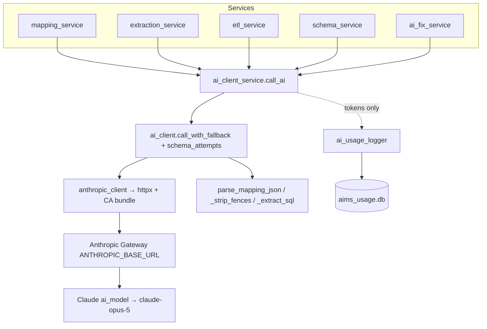

# 10 — AI / GenAI Architecture

## Provider & client

- **Provider:** Anthropic **Claude**, called through the official `anthropic` Python SDK.
- **Gateway:** the SDK's base URL and credentials come from env — `ANTHROPIC_BASE_URL` (a corporate/Bedrock‑style gateway) and `ANTHROPIC_AUTH_TOKEN` **or** `ANTHROPIC_API_KEY`.
- **Client factory:** `ai_client.anthropic_client()` builds `anthropic.Anthropic(...)`; when a corporate CA bundle exists (`ca_bundle()`), it injects an `httpx.Client(verify=<ca_bundle>, timeout=600.0)` so TLS interception is trusted.
- **Model:** resolved by `ai_model()` = `AIMS_MODEL` → `ANTHROPIC_DEFAULT_OPUS_MODEL` → literal `"claude-opus-5"`, then **`.split("[",1)[0]`** strips a context‑window suffix like `[1m]` (the gateway rejects the suffixed variant).
- **Temperature:** **never set** on any call — all rely on gateway/model defaults.
- **Transport:** every call uses `client.messages.stream(**kwargs)` then `stream.get_final_message()` (streamed to the SDK; a single final message is consumed). The extraction endpoint additionally re‑emits progress to the browser as NDJSON.

## Shared plumbing

All AI calls funnel through **`ai_client_service.call_ai(feature_name, run, attempts)`**, which:
1. calls `ai_client.call_with_fallback(run, attempts)` — tries each attempt config in order, returns the first success, and re‑raises the **last** exception if all fail;
2. logs exactly one usage row (tokens from `resp.usage`, duration, `success`/`failed`) **fire‑and‑forget on a daemon thread** (logging can never break a feature); and
3. re‑raises unchanged on failure.

**Structured‑output ladder** `schema_attempts(schema)` (in `ai_client.py`):
```python
[{"output_config": {"effort": "medium", "format": {"type": "json_schema", "schema": schema}}},
 {"output_config": {"format": {"type": "json_schema", "schema": schema}}},
 {"output_config": {"effort": "medium"}},
 {}]
```
This degrades from *effort + schema* → *schema* → *effort* → *bare call*, so a gateway that rejects `output_config` still works (the prompts also demand raw JSON). JSON is parsed by **`parse_mapping_json()`**: `json.loads`, else the first `{`…last `}` slice, else `{"mappings": []}`. Every call also checks `resp.stop_reason == "refusal"`.

## AI architecture diagram



## Every AI/LLM call site

| Call | File / function | Usage label | max_tokens | Streaming | Structured output | Parsing | Notes / retry / fallback |
|---|---|---|---|---|---|---|---|
| Mapping generate | `mapping_service.generate_mappings._call_model` | "AI Mapping Generator" | 16000 | yes | `schema_attempts(MAPPING_ITEM_SCHEMA)` (4‑rung) | `parse_mapping_json` | Loops per entity → per field‑chunk (`FIELD_CHUNK=40`); merge by (entity,column); fabricate "Not Mapped" for omitted fields |
| Mapping regenerate | `mapping_service.regenerate_mapping` | "AI Mapping Generator - Regenerate Field" | 2000 | yes | `[{json_schema SINGLE_MAPPING_SCHEMA}, {}]` | `parse_mapping_json` (empty `{"mappings":[]}`→`{}`) | single field, strictly grounded on supplied source columns |
| Extraction (standard) | `extraction_service._ai_extract_tables_from_text (rich=False)` | "Source Metadata Extraction" | 16000 | yes | `schema_attempts(SOURCE_EXTRACT_SCHEMA)` | `parse_mapping_json` | per‑chunk; retry once then skip; text truncated to `EXTRACT_TEXT_BUDGET=60000`; bypassed by SQL/XLSX fast‑paths |
| Extraction (rich) | same, `rich=True` | "Source Metadata Extraction (rich)" | 16000 | yes | `schema_attempts(RICH_EXTRACT_SCHEMA)` | `parse_mapping_json` | also infers mandatory/pk/fk/fkReference; fast‑paths bypassed |
| Extraction (stream) | `extraction_service.extract_source_stream` | (same labels) | 16000 | yes + NDJSON | same | `parse_mapping_json` | emits start/progress/done/error; per‑chunk retry‑once‑then‑skip |
| ETL stored proc | `etl_service.generate_etl → _generate_with_continuation` | "ETL Code Generator - Stored Procedure" | 8000 | yes | `[{effort:medium}, {}]` | `_strip_fences`, `_strip_leading_use` | auto‑continues up to `_CONTINUE_LIMIT=5` if `stop_reason=="max_tokens"` |
| DDL generate | `etl_service.generate_ddl → _generate_with_continuation` | "ETL Code Generator - Create Table" | 6000 | yes | `[{effort:medium}, {}]` | `_strip_fences`; `_ddl_hallucination_warnings` | flags bracketed identifiers not in the known set |
| Parse column | `schema_service.parse_column` | "Target System - Add Column (AI)" | 2500 | yes | `[{json_schema COLUMNS_SCHEMA}, {}]` | `parse_mapping_json` | tolerates single‑object; flags duplicates; coerces unsupported types |
| Parse entity | `schema_service.parse_entity` | "Target System - Add Entity (AI)" | 16000 | yes | `[{json_schema ENTITY_SCHEMA}, {}]` | `parse_mapping_json` | salvages partial on `max_tokens`, warns |
| Deploy AI fix | `ai_fix_service.fix_batch` | "ETL Deploy - AI SQL Fix" | 4000 | yes | `[{effort:medium}, {}]` | `_extract_sql` (fence/prose salvage, refusal detect) | invoked on batch failure; **no credentials** in prompt; fix surfaced for review, never auto‑deployed |

## Response processing & error handling

- **Mapping/extraction/schema:** JSON parsed by `parse_mapping_json`; missing items filled deterministically (e.g. "Not Mapped" rows, unioned tables).
- **ETL/DDL/fix:** raw SQL cleaned by `_strip_fences`/`_strip_leading_use`/`_extract_sql`; DDL hallucinations flagged in `warnings`.
- **Refusals:** any `stop_reason=="refusal"` → the service returns `{"ok":false,...}, 400`.
- **Truncation:** `max_tokens` handled by field‑chunking (mapping), per‑chunk extraction, and continuation (ETL/DDL).
- **Failure:** broad `except` → `traceback.print_exc()` → `{"ok":false,error}, 400`; a `status="failed"` usage row is logged and the exception re‑raised by `call_ai`.
- **SDK/credentials absent:** `anthropic is None` short‑circuits every AI service with a "not installed" 400; `GET /api/ai/status` reports readiness.

## Anti‑hallucination guarantees (verified by tests)

- Mapping regeneration and DDL generation must use only tables/columns present **verbatim** in the supplied lists ("never invent"); `generate_ddl` flags hallucinated columns (`test_etl_ddl.py`).
- `parse_column`/`parse_entity` flag case‑insensitive duplicates and coerce unsupported types (e.g. `jsonb`→`varchar`) (`test_schema_service.py`).
- The deploy AI‑fix prompt contains **no credentials** and rejects prose‑only refusals and unchanged batches (`test_ai_fix_service.py`).

See [11 — Prompt Inventory](11-prompt-inventory.md) for the verbatim prompts and JSON schemas.
