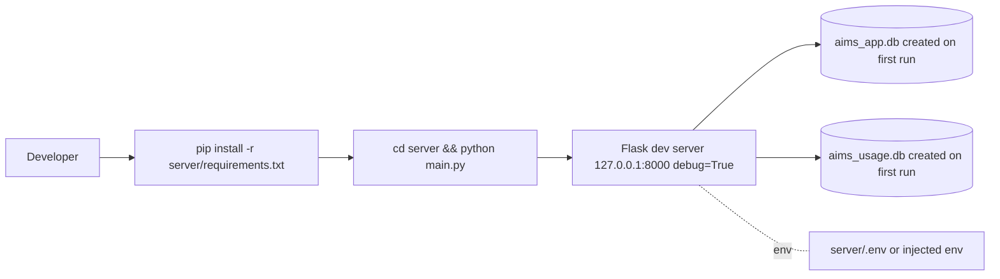

# 19 — Deployment

## Current Implementation

**There is no containerization and no CI/CD in the repository.** An exhaustive search found **no** Dockerfile, `docker-compose*`, Kubernetes/Helm YAML, Terraform, `.github/workflows` (or any other CI config), Procfile, gunicorn/waitress config, or build/deploy scripts (`*.sh`/`*.ps1`). There is no `package.json` and no frontend build step.

The application runs as a **single Flask development server**:

```python
# server/main.py
from app import app
app.run(host="127.0.0.1", port=port(), debug=True, use_reloader=False)
```

- Binds to **127.0.0.1:8000** (`PORT` env, default 8000).
- **`debug=True`** (interactive debugger + verbose error pages).
- **`use_reloader=False`** — deliberate, so the reloader doesn't kill in‑flight background deploy threads or wipe the in‑memory deploy job store.
- A module‑level `app = create_app()` is exposed for WSGI import, but **no WSGI server config is committed**.



## What "build → test → package → deploy" looks like today

| Stage | Reality |
|---|---|
| Build | None (static frontend served as‑is; Python not compiled) |
| Test | `cd server && python -m pytest -q` (manual) |
| Package | None (no artifact/image) |
| Deploy | Run `python server/main.py` on a host with env vars set and the ODBC driver + CA bundle present |
| Runtime | Single process, single origin, SQLite files on local disk |

## Runtime prerequisites (for full functionality)

- **Python** with `server/requirements.txt` installed.
- **Microsoft ODBC Driver for SQL Server** (17 or 18) for live SQL features (else DB endpoints degrade).
- **`server/win-ca-bundle.pem`** (corporate CA bundle; gitignored, rebuilt locally) for the TLS‑intercepting proxy in front of the Claude gateway.
- Env: `AIMS_SECRET_KEY` (required for stable sessions), `ANTHROPIC_BASE_URL` + `ANTHROPIC_AUTH_TOKEN`/`ANTHROPIC_API_KEY`, and (to seed an admin) `AIMS_ADMIN_EMAIL`/`AIMS_ADMIN_PASSWORD`. See [15](15-configuration.md).

## Observed Limitations

- **Not production‑ready as configured:** the Flask dev server + `debug=True` must never face untrusted traffic (the debugger allows code execution; errors leak stack traces).
- **SQLite on local disk** ties data to one host and caps write concurrency (see [23](23-performance-scalability.md)).
- **In‑memory deploy job store** is lost on restart and not shared across processes.

## Recommended Improvements (not implemented)

- Run behind a production WSGI server (e.g. `waitress`/`gunicorn`) with `debug=False`, fronted by a reverse proxy (TLS termination, `Secure` cookies).
- Containerize (Dockerfile) and add CI (lint + `pytest`).
- Set `AIMS_SECRET_KEY` from a secret manager; fail fast if unset.
- If multi‑instance is needed, migrate the SQLite app store to Postgres (the schema is intentionally portable) and move the deploy job store to a shared backend.
