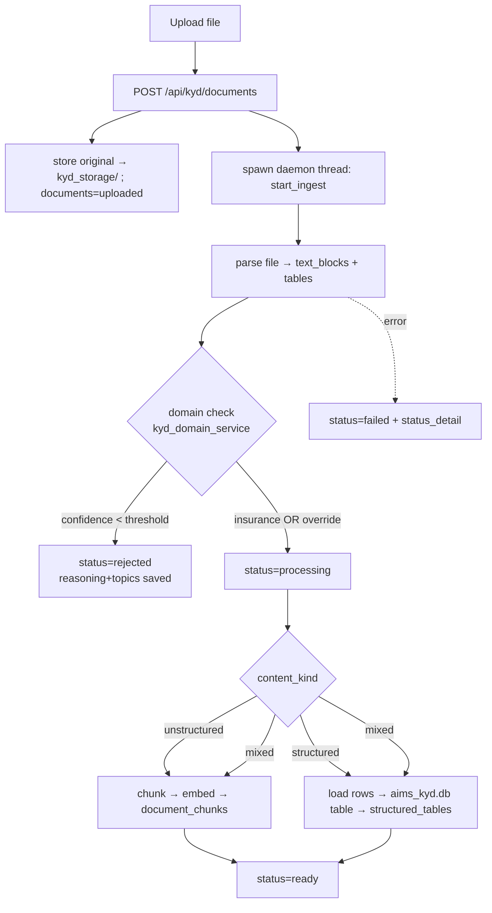
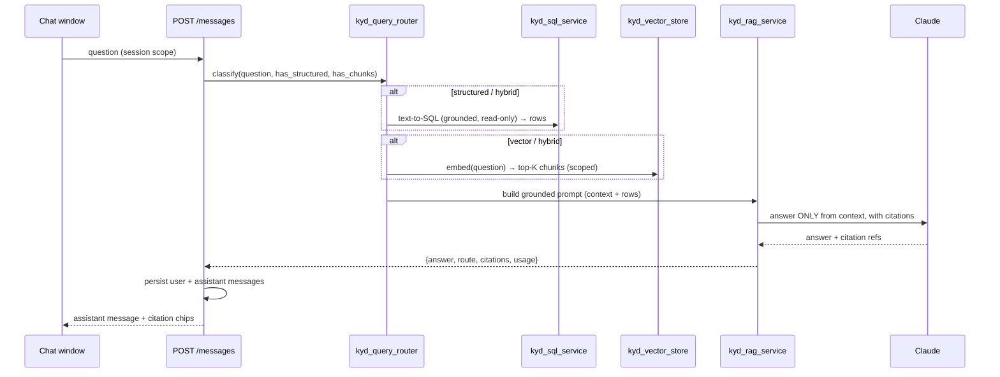

# PLAN — "Know Your Data" (Insurance) Feature

**Status:** Plan only — no implementation code yet.
**Source of truth for stack & conventions:** [`CODEBASE_CONTEXT.md`](CODEBASE_CONTEXT.md).
**Scope:** strictly the **insurance** domain (policies, claims, underwriting, premiums, coverage, etc.). Non‑insurance uploads are rejected (with an override).

Users upload insurance documents → the system validates they're insurance‑related, ingests them (embed unstructured text into a vector store; load structured files into a queryable store) → the user chats and gets **RAG answers with citations**, routing structured questions to SQL/pandas and unstructured questions to vector search.

---

## 0. Stack reconciliation & key decisions (read first)

The feature brief assumes pgvector, a job queue, and file storage. Per `CODEBASE_CONTEXT.md`, **none of those exist as assumed**. Decisions below keep us faithful to the real stack (Flask + SQLite + vanilla JS, layered `api → services → parsers/schemas → core`, session‑scoped multi‑tenancy).

| Brief assumption | Reality (per context doc) | Decision |
|---|---|---|
| **pgvector** for vectors | App DB is **SQLite**, not Postgres | **Not applicable.** Honor the intent ("reuse existing DB for vector storage") by storing embeddings **in SQLite** — `document_chunks.embedding` as a `float32` BLOB, retrieved with in‑Python cosine similarity (numpy). Optional ANN upgrade later via the `sqlite-vec` extension. No Postgres introduced. |
| **Reuse existing job queue** | **No queue exists** — only daemon threads + in‑memory job store (`deployment_service`) | Reuse that **pattern**: an `ingestion_service` runs work on a `threading.Thread(daemon=True)`, but **status is persisted to the `documents` table** (not in‑memory) so it survives restarts. Add a startup reconciler that fails/requeues orphaned `processing` rows. |
| **Reuse existing file storage** | **None exists** — uploads are parsed in memory and discarded | Minimal new addition (the feature needs the original file for re‑ingest + page citations): **local disk** under a gitignored `server/kyd_storage/<user_id>/<client_id>/<doc_id>/`, referenced by `documents.storage_path`. (Alternative: store bytes as a SQLite BLOB — chosen only if single‑file portability outweighs DB size.) |
| **Embeddings** | Gateway is **Anthropic‑only**; Anthropic has **no embeddings API** | Add a **pluggable embedder** with a **local, no‑extra‑credentials default** (`fastembed`, ONNX runtime, `BAAI/bge-small-en-v1.5`, 384‑dim — light, no `torch`). Interface allows swapping to a gateway/Voyage/OpenAI backend later. **Open decision — see §12.** |
| **Structured store** | SQLite + pandas available | Load CSV/Excel/SQL rows into a **separate SQLite file `aims_kyd.db`** as per‑document tables (namespaced by `doc_id`), tracked in `structured_tables`. Query via **read‑only, allow‑listed SQL** (LLM text‑to‑SQL) and/or pandas. |
| **Per‑client state** | `tenant_documents` is a 12‑key, whole‑blob, 6 MB‑capped store | KYD data is large and row‑oriented → **do NOT use the `tenant_documents` blob store**. KYD gets **dedicated tables + REST endpoints**; the frontend calls those directly (like `/api/deploy`), not `CLIENT_STATE`. |
| **Tenancy** | Everything scoped by session `(user_id, client_id)` | Every new table carries `user_id` + `client_id`; every query/endpoint scopes by the **session**, never client input. |

**New SQLite DBs:** `aims_kyd.db` (KYD app tables) and the structured store. (Could be one file; kept separate from `aims_app.db` to isolate potentially large data. Env override `AIMS_KYD_DB`, gitignored `*.db`.) Migrations follow the existing idempotent pattern: a new `kyd_schema.sql` + `ensure_kyd_tables()` run at startup, plus guarded `ALTER TABLE` for in‑place changes.

---

## 1. Data model (new tables)

New schema file `server/app/db/kyd_schema.sql`, applied by `ensure_kyd_tables()` (mirrors `ensure_app_tables`). All tables scoped by `user_id` + `client_id`; foreign keys `ON DELETE CASCADE`; `PRAGMA foreign_keys=ON`.

### `documents`
| Column | Type | Notes |
|---|---|---|
| id | INTEGER PK | |
| user_id | INTEGER NOT NULL | FK → users(id) (in `aims_app.db`; enforced in app layer, not cross‑file FK) |
| client_id | INTEGER NOT NULL | tenant scope |
| filename | TEXT NOT NULL | original name |
| file_ext | TEXT | pdf/xml/json/sql/xlsx/csv |
| mime_type | TEXT | |
| size_bytes | INTEGER | |
| storage_path | TEXT | path under `kyd_storage/` (or NULL if BLOB mode) |
| content_kind | TEXT | `unstructured` \| `structured` \| `mixed` |
| **status** | TEXT NOT NULL | **`uploaded` → `processing` → `ready` \| `failed` \| `rejected`** |
| status_detail | TEXT | human‑readable last message / error |
| **detected_topics** | TEXT (JSON array) | e.g. `["claims","premiums"]` |
| **domain_check_confidence** | REAL | 0–100 insurance‑relevance score |
| **domain_check_reasoning** | TEXT | model's justification (audit) |
| domain_override | INTEGER DEFAULT 0 | set when user force‑ingests a rejected doc |
| chunk_count | INTEGER DEFAULT 0 | |
| table_count | INTEGER DEFAULT 0 | structured tables created |
| created_at / updated_at | TEXT | ISO UTC |

Index: `ix_docs_scope(user_id, client_id)`, `ix_docs_status(status)`.

### `document_chunks` (vector store, SQLite‑native)
| Column | Type | Notes |
|---|---|---|
| id | INTEGER PK | |
| document_id | INTEGER NOT NULL | FK → documents(id) ON DELETE CASCADE |
| user_id / client_id | INTEGER NOT NULL | denormalized for scoped retrieval |
| chunk_index | INTEGER | order within the doc |
| text | TEXT NOT NULL | the chunk |
| token_estimate | INTEGER | |
| page | INTEGER | for PDF citations (nullable) |
| section | TEXT | heading/sheet/label for citations |
| embedding | BLOB NOT NULL | `float32` little‑endian, length = embed dim |
| embed_model | TEXT | provenance (model + dim) |

Index: `ix_chunks_scope(user_id, client_id, document_id)`.
Retrieval: `SELECT ... WHERE user_id=? AND client_id=? [AND document_id IN (...)]` → cosine similarity in numpy → top‑K.

### `structured_tables` (registry of loaded structured data)
| Column | Type | Notes |
|---|---|---|
| id | INTEGER PK | |
| document_id | INTEGER NOT NULL | FK → documents(id) ON DELETE CASCADE |
| user_id / client_id | INTEGER NOT NULL | |
| logical_name | TEXT | sheet/table name as seen by the user |
| physical_table | TEXT NOT NULL | actual table in `aims_kyd.db`, namespaced e.g. `kyd_d{document_id}_{slug}` |
| columns_json | TEXT | `[{name,type,sample}]` for text‑to‑SQL grounding |
| row_count | INTEGER | |
| created_at | TEXT | |

Index: `ix_struct_scope(user_id, client_id, document_id)`. The physical per‑document tables themselves live in `aims_kyd.db`, created dynamically and dropped on document delete.

### `chat_sessions`
| Column | Type | Notes |
|---|---|---|
| id | INTEGER PK | |
| user_id / client_id | INTEGER NOT NULL | scope |
| title | TEXT | auto from first question |
| document_scope | TEXT (JSON array) | doc ids in scope (NULL/empty = all ready docs for the client) |
| created_at / updated_at | TEXT | |

Index: `ix_sessions_scope(user_id, client_id)`.

### `chat_messages`
| Column | Type | Notes |
|---|---|---|
| id | INTEGER PK | |
| session_id | INTEGER NOT NULL | FK → chat_sessions(id) ON DELETE CASCADE |
| user_id / client_id | INTEGER NOT NULL | scope (defense in depth) |
| role | TEXT | `user` \| `assistant` |
| content | TEXT NOT NULL | |
| route | TEXT | `vector` \| `structured` \| `hybrid` (for assistant msgs) |
| citations_json | TEXT | `[{documentId, chunkId?, page?, section?, table?, snippet}]` |
| usage_json | TEXT | token counts (mirrors usage logging) |
| created_at | TEXT | |

Index: `ix_messages_session(session_id, id)`.

```mermaid
erDiagram
  documents ||--o{ document_chunks : has
  documents ||--o{ structured_tables : has
  chat_sessions ||--o{ chat_messages : has
  documents { int id PK; int user_id; int client_id; text status; text detected_topics; real domain_check_confidence; text domain_check_reasoning }
  document_chunks { int id PK; int document_id FK; blob embedding; int page; text section }
  structured_tables { int id PK; int document_id FK; text physical_table; text columns_json }
  chat_sessions { int id PK; int user_id; int client_id; text document_scope }
  chat_messages { int id PK; int session_id FK; text role; text route; text citations_json }
```

---

## 2. New backend modules

All under `server/app/`, following the layering rule. **Parsers stay pure** (no Flask/Anthropic); **services** own DB/LLM/threads and return `(payload, status)`.

| Module | Layer | Responsibility |
|---|---|---|
| `parsers/kyd_file_parser.py` | parsers (pure) | Dispatch by extension → normalized output. **Reuse existing** `pypdf`/`openpyxl`/`python-docx` and `sql_ddl_parser`; add XML (`xml.etree`), JSON, CSV (stdlib `csv`). Returns `{content_kind, text_blocks:[{text,page,section}], tables:[{name,columns,rows}]}`. |
| `services/kyd_domain_service.py` | service | **Insurance domain validator.** Cheap keyword/heuristic pre‑filter → Claude classification (via `ai_client_service.call_ai`) returning `{isInsurance, confidence, reasoning, topics[]}`. Writes `domain_check_*`, `detected_topics`. Below threshold → `rejected`. |
| `parsers/kyd_chunker.py` | parsers (pure) | Split unstructured text into overlapping chunks (reuse `text_chunking` conventions; add token‑aware sizing + page/section carry‑through for citations). |
| `services/kyd_embedder.py` | service | **Pluggable embedder.** Default: `fastembed` local model (ONNX, 384‑dim, no torch/creds). Interface `embed(texts)->list[vec]`; batching; records `embed_model`. Swappable backend (gateway/Voyage/OpenAI). |
| `services/kyd_vector_store.py` | service | SQLite‑native vector store over `document_chunks`: `add(chunks, vectors)`, `search(query_vec, uid, cid, doc_ids, k)` (scoped SELECT → numpy cosine top‑K). Optional `sqlite-vec` path behind the same interface. |
| `services/kyd_structured_loader.py` | service | Load CSV/Excel/SQL rows into per‑document tables in `aims_kyd.db`; register in `structured_tables`; infer column types; enforce name namespacing + row/column caps. |
| `services/kyd_ingestion_service.py` | service | **Orchestrator + background worker.** `start_ingest(doc_id)` spawns a `daemon` thread; pipeline: parse → domain‑check → (chunk+embed / structured‑load) → set `ready`/`failed`; updates `documents.status` at each step. Startup reconciler for orphaned `processing`. Mirrors `deployment_service`'s thread pattern. |
| `services/kyd_query_router.py` | service | Decide route per question: `structured` (aggregations/filters over loaded tables), `vector` (semantic), or `hybrid`. Heuristics + a light LLM classifier; considers whether the client has structured tables and/or chunks. |
| `services/kyd_sql_service.py` | service | **Structured querying.** LLM **text‑to‑SQL** grounded on `structured_tables.columns_json`, executed **read‑only** (SELECT‑only allow‑list, only that client's `kyd_d*` tables, row‑limit) via a sandboxed sqlite3 connection; or pandas over the loaded frame. Returns rows + the SQL used (for citation/audit). |
| `services/kyd_rag_service.py` | service | **RAG answer service.** For vector/hybrid: retrieve top‑K chunks → build a grounded prompt ("answer only from context; cite sources") → Claude → parse answer + map citations back to `document_chunks`. For structured: summarize query results with citations to the table/SQL. Returns `{answer, route, citations, usage}`. |
| `schemas/kyd_schemas.py` | schemas | JSON Schemas: domain‑check result, text‑to‑SQL result, RAG answer (answer + citations[]). |
| `db/kyd_schema.sql` + `db/app_db.py` (`ensure_kyd_tables`) | core/db | New tables (idempotent) + in‑place `ALTER` helper; `aims_kyd.db` connection helper + its own `write_lock`. |
| `core/config.py` (additions) | core | `AIMS_KYD_DB` path, `kyd_storage` dir, embed backend/model, `KYD_*` tuning (chunk size/overlap, top‑K, domain threshold, max upload size, row/col caps). |

All Claude calls go through the existing `ai_client_service.call_ai(feature_name, ...)` so they're logged to `aims_usage.db` with labels like `"Know Your Data - Domain Check"`, `"Know Your Data - Text to SQL"`, `"Know Your Data - RAG Answer"`.

---

## 3. New API endpoints

New blueprint `server/app/api/kyd_routes.py`, `url_prefix="/api/kyd"`. All require a session **and an active client** (401/409 like `/api/state`). Mutating methods are CSRF‑protected automatically (frontend `installCsrfFetch`). Every handler scopes by session `(uid, cid)`.

| Method | URL | Purpose | Service |
|---|---|---|---|
| POST | `/api/kyd/documents` | **Upload** a file (multipart). Stores original, creates `documents` row (`uploaded`), kicks off ingestion (→ `processing`). | `kyd_ingestion_service.start_ingest` |
| GET | `/api/kyd/documents` | **List** the client's documents (status, topics, counts, timestamps). | — |
| GET | `/api/kyd/documents/<id>/status` | **Ingestion status** for polling (status, status_detail, progress, chunk/table counts). | — |
| DELETE | `/api/kyd/documents/<id>` | **Delete** doc + chunks + structured tables + stored file (cascade). | `kyd_ingestion_service` |
| POST | `/api/kyd/documents/<id>/force-ingest` | **Override** a `rejected` doc: set `domain_override=1`, re‑run ingestion skipping the domain gate. | `kyd_ingestion_service` |
| POST | `/api/kyd/chat/sessions` | **Create** a chat session (optional `document_scope`). | — |
| GET | `/api/kyd/chat/sessions` | List sessions. | — |
| POST | `/api/kyd/chat/sessions/<id>/messages` | **Send message** → route → answer with citations; persists user + assistant messages. | `kyd_query_router` + `kyd_rag_service` |
| GET | `/api/kyd/chat/sessions/<id>/messages` | **Get history** for a session. | — |
| DELETE | `/api/kyd/chat/sessions/<id>` | Delete a session + its messages. | — |

Validation/limits: max upload size, allowed extensions, per‑client document cap — enforced at the route (addresses an existing gap noted in the security doc). Cross‑tenant id access → 403/404.

Register `kyd_bp` in `create_app()` and call `ensure_kyd_tables()` at startup (next to `ensure_app_tables()`).

---

## 4. Ingestion pipeline (flow)



Frontend polls `/status` (like the deploy polling pattern). On restart, a reconciler marks stale `processing` rows `failed` (or requeues).

## 5. Query & answer flow (RAG + routing)



Citations map to `document_chunks` (doc + page/section + snippet) for vector answers, and to the structured table + the executed SQL for structured answers. The RAG prompt forbids answering outside the provided context (reduces hallucination; consistent with the app's existing "don't invent" guardrails).

## 6. Domain validation (insurance‑only)

- **Pre‑filter:** keyword/pattern scan (policy, claim, premium, underwriting, coverage, insured, deductible, endorsement, etc.) for a cheap signal.
- **Classifier:** Claude returns `{isInsurance: bool, confidence: 0‑100, reasoning: str, topics: string[]}` against `KYD_DOMAIN_SCHEMA`. Persist `domain_check_confidence`, `domain_check_reasoning`, `detected_topics`.
- **Gate:** `confidence < KYD_DOMAIN_THRESHOLD` → `rejected` (with reasoning shown to the user). **Force‑ingest** sets `domain_override=1` and bypasses the gate on re‑run.

---

## 7. Frontend components

New page `pages/know-your-data.html` + controller `js/know-your-data.js` (follows the standard `initShell("know-your-data.html")` pattern; sidebar entry under a suitable section). KYD data uses the **dedicated `/api/kyd/*` endpoints**, not `CLIENT_STATE`. All AI/user text rendered via `escapeHtml`. Styling via existing tokens/Bootstrap; new component styles in `css/know-your-data.css` (cache‑busted).

| Component | Behavior |
|---|---|
| **Upload widget** | Drag‑drop/select; shows accepted types; posts to `/api/kyd/documents`; optimistic row in `uploaded`. Client‑side size/type check mirrors server limits. |
| **Document manager** | Table/cards of documents with a **status pill** (uploaded/processing/ready/failed/**rejected**). Rejected rows show `domain_check_reasoning` + detected topics + a **"Ingest anyway"** button (`/force-ingest`) behind a confirm dialog. Delete with confirm. |
| **Ingestion progress** | Polls `/status` (reuse the deploy‑polling approach) with a progress indicator; transitions the pill live; surfaces `status_detail` on failure. |
| **Chat window** | Session picker/create; scrollable transcript; input box; disabled until at least one `ready` document. Optional document‑scope selector. |
| **Message bubble** | User vs assistant styling; assistant shows the **route badge** (vector/structured/hybrid). |
| **Citation chip** | Compact chips under assistant answers: doc name + page/section (or table + "view SQL"); click → popover with the source snippet / the executed SQL. |

State: page‑local module state + polling; sessions/messages fetched from the API. No new `tenant_documents` keys (KYD is row‑oriented and can exceed the 6 MB blob cap).

---

## 8. Third‑party dependencies to add

Chosen to fit the current stack (Python/Flask/SQLite, offline‑friendly, no new external credentials by default). Reuse existing parsers where possible.

| Dependency | Why | Notes / alternative |
|---|---|---|
| `numpy` | Cosine similarity for SQLite‑native vector search; array math | Small, ubiquitous. |
| `fastembed` | **Local embeddings** (ONNX runtime, `bge-small-en-v1.5`, 384‑dim) — no torch, no API key | Keeps embeddings self‑contained like the rest of the app. **Alternative:** gateway/Voyage/OpenAI embeddings (adds creds) or `sentence-transformers`+`torch` (heavier). Behind the `kyd_embedder` interface, so swappable. |
| `pandas` | Structured querying / type inference for CSV/Excel loads | Also useful for pandas‑route answers. |
| *(reused)* `pypdf`, `openpyxl`, `python-docx` | Already present — PDF/Excel/Word parsing | No change. |
| *(stdlib)* `csv`, `json`, `xml.etree.ElementTree`, `sqlite3` | CSV/JSON/XML parsing; structured store | No new dep. |
| *(optional)* `sqlite-vec` | ANN vector index in SQLite if corpora grow beyond brute‑force comfort | Behind `kyd_vector_store`; not required for v1. |

**Explicitly NOT added:** pgvector/Postgres (app is SQLite), Celery/RQ/Redis (reuse daemon‑thread pattern), any object‑storage SDK (local disk store). All new `*.db` and `kyd_storage/` are gitignored.

---

## 9. Security, tenancy & limits

- **Isolation:** every KYD table has `user_id`+`client_id`; every query/endpoint scopes by the **session** (never client input); cross‑tenant ids → 403/404. Deleting a user/client cascades KYD rows and stored files.
- **Text‑to‑SQL safety:** SELECT‑only allow‑list, restricted to that client's `kyd_d*` tables, hard row limit, read‑only connection, timeout. The model never sees credentials.
- **RAG grounding:** answer only from retrieved context; citations required; refusals handled like existing AI services.
- **Uploads:** enforce max size + extension allow‑list at the route (closes a gap flagged in `docs/16-security.md`); store outside the web root; never execute uploaded SQL against a live DB (it's parsed/loaded into the sandboxed `aims_kyd.db` only).
- **CSRF/auth:** inherited from the existing guards.
- **Usage logging:** every Claude call logged (tokens only) via `call_ai`.

## 10. Migrations & config

- `db/kyd_schema.sql` (CREATE TABLE IF NOT EXISTS) + `ensure_kyd_tables()` at startup; in‑place `ALTER TABLE` guarded by "column exists?" checks (mirrors `_ensure_user_columns`).
- New config in `core/config.py`: `AIMS_KYD_DB`, `kyd_storage_dir()`, `KYD_EMBED_BACKEND`/`KYD_EMBED_MODEL`, `KYD_CHUNK_SIZE`/`KYD_CHUNK_OVERLAP`, `KYD_TOP_K`, `KYD_DOMAIN_THRESHOLD`, `KYD_MAX_UPLOAD_BYTES`, `KYD_STRUCT_ROW_CAP`. Documented in `.env.example`.

## 11. Phasing / milestones

1. **P1 — Ingest & manage (unstructured):** schema + storage + upload/list/delete/status endpoints; parser + domain validator + chunker + embedder + SQLite vector store; document manager + upload widget + progress + rejected handling + force‑ingest. *Verify:* upload a PDF/text policy doc → rejected for a non‑insurance file, ready for an insurance file; chunks embedded; delete cleans up.
2. **P2 — Chat + RAG (vector):** chat sessions/messages endpoints; `kyd_rag_service`; chat window + bubbles + citation chips. *Verify:* ask a question → grounded answer with working citations; isolation across clients.
3. **P3 — Structured routing:** structured loader + `structured_tables` + `kyd_sql_service` + `kyd_query_router` (hybrid). *Verify:* CSV/Excel of claims → "total premium by state?" routes to SQL with a table/SQL citation.
4. **P4 — Hardening:** startup reconciler for orphaned ingests, upload limits, `sqlite-vec` option, embed‑backend swap, tests.

## 12. Open decisions (need a call before build)

1. **Embedding backend:** local `fastembed` (recommended — offline, no creds) vs. a hosted embeddings API via the gateway (better quality, adds credentials/egress). Affects `embed_model`/dim stored on chunks.
2. **File storage:** local disk (`kyd_storage/`, recommended) vs. SQLite BLOB (single‑file portability, larger DB).
3. **Vector search:** brute‑force numpy (simple, fine for small per‑tenant corpora) vs. `sqlite-vec` from day one (more setup). Recommend brute‑force for v1.
4. **Structured querying:** LLM text‑to‑SQL over SQLite (recommended, citable SQL) vs. pandas‑only. Recommend SQL with strict allow‑listing.
5. **DB file:** separate `aims_kyd.db` (recommended, isolates large data) vs. adding tables to `aims_app.db`.

## 13. Risks

- **Background durability:** daemon‑thread ingestion is per‑process; long ingests are interrupted by restarts (mitigated by DB‑persisted status + reconciler). A real queue is out of scope but the natural future upgrade.
- **Embedding model weight/first‑run download:** `fastembed` fetches the ONNX model on first use — needs network once or a bundled model for air‑gapped installs.
- **SQLite write concurrency:** ingestion writes many chunks under the global write lock; batch inserts and keep ingestion off the request thread (already the plan).
- **Text‑to‑SQL correctness/safety:** mitigated by grounding on `columns_json`, SELECT‑only allow‑listing, and returning the SQL for transparency.
