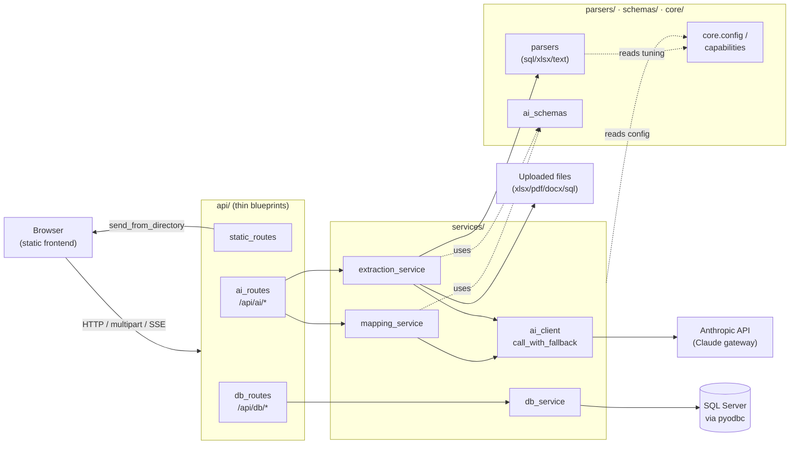

# AI Mapping Studio — backend

A small Flask service that (1) serves the static frontend and (2) exposes the
SQL Server + Claude AI APIs the app needs. A browser can't open a database
socket or safely hold API credentials, so this service holds the ODBC driver
and the Anthropic client and does that work over HTTP — everything runs on one
origin (`http://127.0.0.1:8000`), so there's no CORS.

Originally a single ~1550-line `app.py`; now a layered package so each concern
is isolated and unit-testable.

## Run locally

```
pip install -r requirements.txt
cd server
python main.py
```

Open **http://127.0.0.1:8000/**. Flask runs with `debug=True` (auto-reload).

Run the tests:

```
cd server
python -m pytest -q
```

## Required environment

| Variable | Purpose | Needed for |
|---|---|---|
| `ANTHROPIC_API_KEY` **or** `ANTHROPIC_AUTH_TOKEN` | Claude credential | All `/api/ai/*` endpoints |
| `ANTHROPIC_BASE_URL` | Corporate/Bedrock gateway URL (omit for `api.anthropic.com`) | AI, when using a gateway |
| `AIMS_MODEL` **or** `ANTHROPIC_DEFAULT_OPUS_MODEL` | Model id (default `claude-opus-5`); any `[1m]` suffix is stripped | AI (optional) |
| `PORT` | Server port (default `8000`) | optional |
| `SSL_CERT_FILE` / `REQUESTS_CA_BUNDLE` / `CURL_CA_BUNDLE` | CA bundle fallbacks for a TLS-intercepting proxy | AI behind a corporate proxy |

The backend **degrades gracefully** if an optional package is missing (`pyodbc`,
`anthropic`, `openpyxl`, `pypdf`, `python-docx`): it still boots and reports the
missing package only when a matching request arrives (see `core/capabilities.py`).

**CA bundle:** `ca_bundle()` (in `app/core/config.py`) prefers `server/win-ca-bundle.pem`
(gitignored — rebuild locally from the Windows trust store), then the env bundles
above. `anthropic_client()` wires it into the httpx transport so the TLS handshake
to an internal gateway succeeds.

## Folder structure & layer responsibilities

```
server/
├── main.py                     # entry point: from app import app; app.run(...)
└── app/
    ├── __init__.py             # create_app() factory — registers the 3 blueprints
    ├── core/
    │   ├── config.py           # ROOT, port(), ai_model(), ca_bundle(), EXTRACT_* tuning
    │   └── capabilities.py     # optional-import guards (pyodbc/anthropic/openpyxl/pypdf/docx)
    ├── schemas/
    │   └── ai_schemas.py       # 3 JSON schemas for Claude structured output
    ├── parsers/                # PURE — no Flask, no Anthropic, no I/O beyond bytes-in
    │   ├── text_chunking.py    # split_text_chunks, split_by_tables, table_marker
    │   ├── sql_ddl_parser.py   # parse_sql_ddl (deterministic CREATE TABLE parser)
    │   └── file_parsers.py     # xlsx/pdf/docx readers + parse_xlsx_dictionary
    ├── services/               # business logic — each returns (payload_dict, http_status)
    │   ├── ai_client.py        # anthropic_client, call_with_fallback, schema_attempts, parse_mapping_json, ai_status
    │   ├── db_service.py       # connection string, metadata, profiling
    │   ├── mapping_service.py  # generate_mappings, regenerate_mapping
    │   └── extraction_service.py # extract_source (+ streaming NDJSON generator)
    └── api/                    # THIN blueprints — parse request → call service → jsonify
        ├── static_routes.py    # /  and  /<path:path>
        ├── db_routes.py        # /api/db/*
        └── ai_routes.py        # /api/ai/*  (incl. the SSE streaming endpoint)
```

**Layering rule (import direction only downward):**

```
api → services → parsers, schemas → core
```

- **core** depends on nothing but stdlib + the optional libs. `parsers` are pure
  and independently testable. `services` hold all business logic and never touch
  `request`/`jsonify`. `api` blueprints contain no logic — they marshal the
  request and jsonify whatever the service returns.
- **Shared AI plumbing** lives in `services/ai_client.py`: `call_with_fallback()`
  + `schema_attempts()` unify the "try structured-output configs, degrade to a
  bare call" retry ladder that generation, regeneration, and extraction all use.

## Endpoints

| Method | Path | Purpose |
|---|---|---|
| GET  | `/`, `/<path>` | Serve the static frontend |
| GET  | `/api/db/drivers` | List installed ODBC drivers |
| POST | `/api/db/test` | Test a SQL Server connection |
| POST | `/api/db/metadata` | Real tables + columns (PK/FK, row counts) |
| POST | `/api/db/profile` | Per-column profiling for one table |
| GET  | `/api/ai/status` | Whether AI is usable (SDK + credentials) |
| POST | `/api/ai/generate-mappings` | Map target schema ← source columns |
| POST | `/api/ai/regenerate-mapping` | Re-map one field on an instruction |
| POST | `/api/ai/extract-source` | File → source tables/columns |
| POST | `/api/ai/extract-source-stream` | Same, streaming NDJSON progress events |

Connection details are posted per request and used only to open a short-lived
connection; nothing is persisted server-side.

## Request flow



**Two AI patterns worth knowing** (both defeat output-token truncation / model
summarizing by *loop + merge*, never one big call):

- **generate-mappings** loops per target entity, splitting wide entities into
  field-chunks, then merges by column.
- **extract-source** chunks the file (SQL DDL and structured Excel dictionaries
  are parsed deterministically with **no AI**), runs one AI call per chunk with
  per-chunk retry/skip, and unions tables by name. The `-stream` variant emits
  NDJSON progress events for the UI progress bar.
